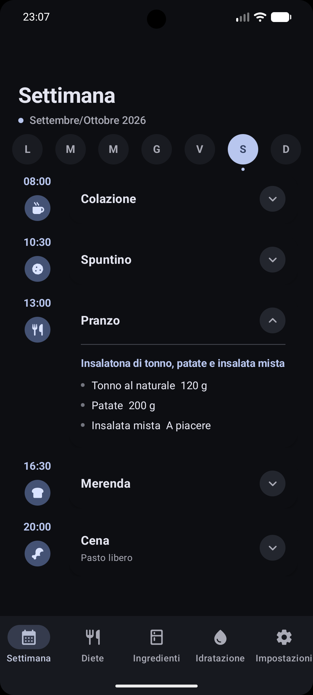
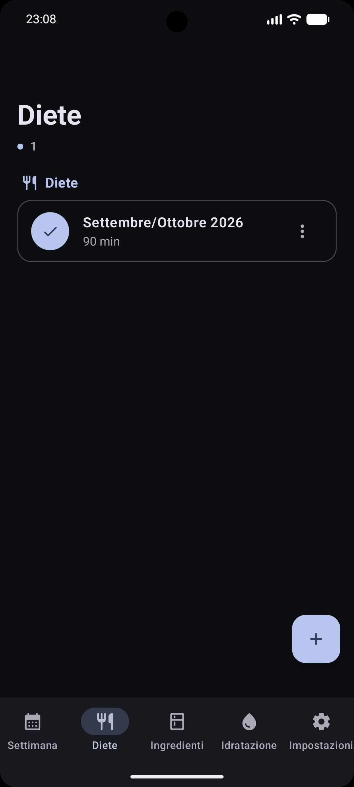
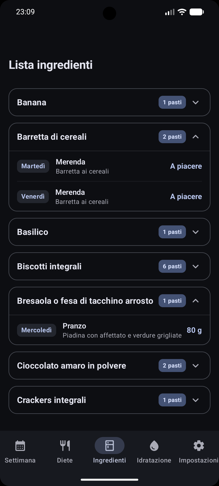
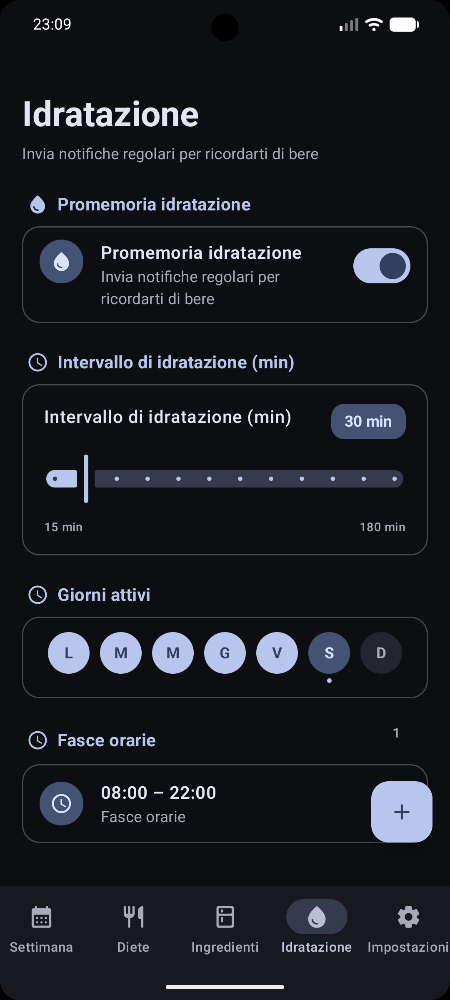
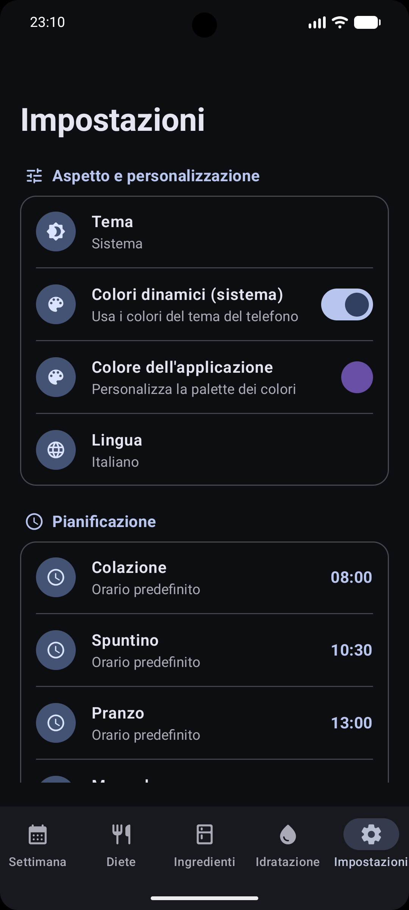
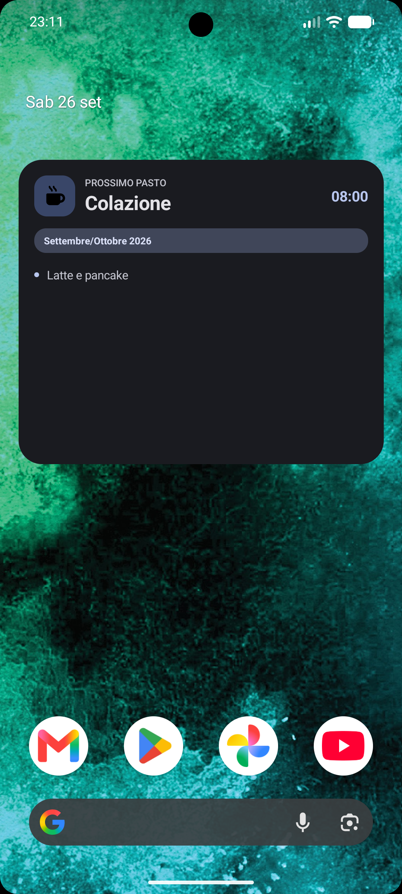

# Diet Reminder

Diet Reminder is a native Android application designed for managing weekly dietary plans, centralizing ingredient tracking, monitoring daily hydration, and providing home-screen widget integration.

Built with Kotlin, Jetpack Compose, Material 3, Room Database, and Jetpack Glance.

## Overview

Diet Reminder provides an end-to-end solution for organizing structured meal plans. It enables users to configure multi-diet schedules, view aggregated weekly ingredients with detailed meal breakdowns, configure hydration reminder windows, and track upcoming meals directly from the Android Home Screen.

## Core Capabilities

### 1. Dietary Schedule Management
- **Multi-Diet Support:** Create, duplicate, activate, and manage multiple weekly diet configurations.
- **Data Export & Import:** Import and export diet plans in structured JSON format (`.dr`).
- **Daily Timeline:** View daily scheduled meals categorized by meal types (*Breakfast*, *Lunch*, *Dinner*, etc.) and custom times.
- **Detailed Course Breakdown:** Organize meals into flexible courses (*First course*, *Main course*, *Side dish*) containing specific food items and quantities.

### 2. Centralized Ingredient Management
- **Aggregated Weekly Table:** Automatically computes and groups all food items across the active diet plan.
- **Expandable Detail View:** Tap any ingredient entry to inspect its exact occurrence across days of the week, meal types, courses, and quantities.
- **Real-Time Autocomplete:** Suggests previously entered food items during meal configuration to prevent duplicate entries and typos.

### 3. Hydration Tracker
- **Daily Water Counter:** Track daily water glass consumption.
- **Customizable Alert Windows:** Configure specific notification windows (e.g. 08:00 to 22:00) and reminder intervals.

### 4. Home Screen Widget (Jetpack Glance)
- **Native Glance Widget:** Displays the next upcoming scheduled meal directly on the home screen.
- **Background Synchronization:** Powered by WorkManager and AlarmManager for reliable real-time updates.

### 5. Customization & System Integration
- **Material You Dynamic Colors:** Integrates with system dynamic color palettes on Android 12+.
- **Theme Support:** Supports System, Light, and Dark themes.
- **Localization:** Full native support for Italian and English.

## User Interface Screenshots

|                   Weekly Schedule                   |                   Diets Management                    |                      Ingredients List                       |
|:---------------------------------------------------:|:-----------------------------------------------------:|:-----------------------------------------------------------:|
|  |  |  |

|                     Hydration Tracker                      |                     Settings                     |                    Home Screen Widget                    |
|:----------------------------------------------------------:|:------------------------------------------------:|:--------------------------------------------------------:|
|  |  |  |

## Technical Architecture

The application follows Android architectural best practices using MVVM (Model-View-ViewModel), a Repository pattern, and a clean domain layer.

- **Language:** Kotlin 2.4.20
- **UI Framework:** Jetpack Compose with Material 3 (1.4.0)
- **Database:** Room 2.8.5 with KSP 2.3.12 (Type Converters, Foreign Key Constraints with CASCADE deletion)
- **App Widget:** Jetpack Glance 1.2.0
- **Background Work:** WorkManager 2.11.2 & AlarmManager
- **Navigation:** Type-Safe Navigation Compose with Kotlinx Serialization
- **Testing Infrastructure:** JUnit4, Robolectric 4.14, Compose UI Test Rules & Robot Pattern

### Environment Specifications
- **Compile SDK:** 37
- **Target SDK:** 36
- **Min SDK:** 34
- **Java Compatibility:** JDK 21
- **Gradle Version:** 9.7.1 (Android Gradle Plugin 9.4.0)
